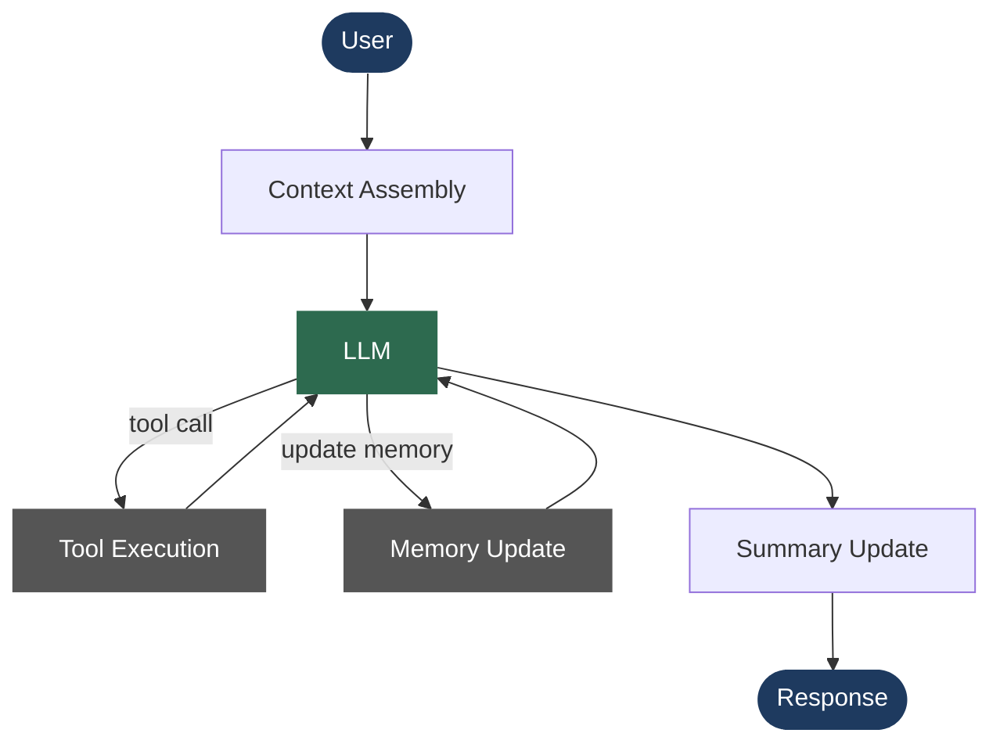

# Agent Kernel

A minimal LLM agent kernel for building assistants that know their place.

The framework orchestrates the conversation. Everything else belongs to the application.

The kernel handles the **loop** — prompt assembly, tool calling, conversation memory, summarisation, and UI rendering — and deliberately stays out of the way of everything else. Your application owns its state, its tools, its UI, its MCP servers, its plugins, and its knowledge base. The kernel never inspects any of it.

Everything in the framework is replaceable. There are no required implementations — only required interfaces.

---

## Philosophy

Most agent frameworks grow into platforms. This one grows in the opposite direction: the core is kept as small and replaceable as possible so that application code — the part that actually knows about your domain — is never constrained by framework opinions.

The rule is simple: **if the kernel needs to know what your app does, something is wrong.**

---

## Agent loop



Context assembly builds the system prompt from all registered providers (static KB, guest profile, RAG passages, current time, memory) before each call. Tool execution and memory updates each trigger a follow-up LLM call within the same turn. The summary is updated asynchronously when old turns are evicted from the context window.

---

## Folder structure

```
agent-kernel/
│
├── src/                        # Framework core — no app knowledge
│   ├── interfaces.py           # Abstract base classes (the only contract)
│   ├── agent.py                # Single-turn agent loop
│   ├── cli.py                  # REPL entry point and session wiring
│   ├── context.py              # System prompt and message list assembly
│   ├── summarizer.py           # Rolling conversation summariser
│   ├── llm.py                  # OpenAI-compatible LLM client + embeddings
│   ├── config.py               # Config dataclasses loaded from config.toml
│   ├── tool_loader.py          # Auto-discovers Tool implementations
│   ├── mcp_client.py           # MCP server client (stdio + SSE)
│   └── server.py               # Web server entry point (--web mode)
│
├── app/                        # Demo application — cruise assistant
│   ├── runtime.py              # AppState dataclass + AppRuntime alias
│   ├── db.py                   # SQLite helpers for the cruise database
│   ├── guest_context.py        # Guest profile → StaticContextProvider
│   └── rag/
│       ├── store.py            # sqlite-vec vector store (3072-dim)
│       └── ingest.py           # Chunker + embedding pipeline
│
├── plugins/                    # Drop-in implementations of framework interfaces
│   ├── dynamic_datetime_now.py # Current date/time → DynamicContextProvider
│   ├── dynamic_rag_context.py  # Semantic search results → DynamicContextProvider
│   ├── memory_file.py          # File-backed MemoryProvider
│   ├── static_file_bible.py    # Markdown file → StaticContextProvider
│   ├── static_kb_directory.py  # Directory of .md files → StaticContextProvider
│   ├── ui_rich_cli.py          # Rich-powered terminal UI
│   ├── ui_web.py               # FastAPI web UI
│   ├── ui_websocket.py         # WebSocket UI provider
│   └── tools/                  # Auto-discovered Tool implementations
│       ├── think.py            # Internal reasoning scratchpad
│       ├── deep_think.py       # Extended analytical reasoning pass
│       ├── emergency.py        # Emergency escalation (requires approval)
│       └── hello.py            # Example/test tool
│
├── db/
│   ├── cruise.db               # SQLite cruise demo database
│   ├── kb/                     # Knowledge base markdown files (static context)
│   ├── rag/                    # Vector store + ingested experience documents
│   │   └── exp_*.md            # De-identified guest experience summaries
│   └── chats/                  # Per-guest conversation history and memory
│
├── mcp/
│   └── dining_mcp_server.py    # Example MCP server (dining reservations)
│
├── scripts/
│   └── eval_rag.py             # RAG retrieval quality evaluation
│
├── config.toml                 # Active configuration
├── config.toml.example         # Annotated reference configuration
└── pyproject.toml
```

---

## Interfaces

Everything the framework calls is defined in `src/interfaces.py`. Implement any of these and pass your instance in — the framework never cares what's behind them.

### `StaticContextProvider`
Injected once per turn into the **stable** prefix of the system prompt. Good for content that rarely changes (knowledge bases, personas, guest profiles). On KV-cache–capable local backends, this section is cached and not re-encoded on every turn.

```python
class StaticContextProvider(ABC):
    def get(self) -> str: ...
```

### `DynamicContextProvider`
Injected per-turn into the **volatile** section of the system prompt. Use for anything that changes every request: current time, live search results, RAG passages.

```python
class DynamicContextProvider(ABC):
    def get(self) -> str: ...
```

### `MemoryProvider`
Provides and persists the assistant's per-session memory — facts about the user that survive across conversation windows.

```python
class MemoryProvider(ABC):
    def get(self) -> str: ...
    def save(self, text: str) -> None: ...
```

### `Tool`
A callable the LLM can invoke via function calling. Implement `schema()` to describe it in OpenAI tool format and `run()` to execute it. Set `requires_approval = True` to pause for human confirmation before execution.

```python
class Tool(ABC):
    requires_approval: bool = False

    @property
    def name(self) -> str: ...

    def schema(self) -> dict: ...   # OpenAI function-calling schema
    def run(self, args: dict) -> str: ...
```

### `UserInterfaceProvider`
Abstracts all user interaction. Swap this to move between terminal, web, WebSocket, or any other surface without touching the agent loop.

```python
class UserInterfaceProvider(ABC):
    def ask_input(self) -> str: ...
    def show_response(self, text: str) -> None: ...
    def show_tool_call(self, name: str, arguments: str) -> None: ...
    def show_tool_result(self, name: str, result: str) -> None: ...
    def show_banner(self, model: str, base_url: str) -> None: ...
    # … and a few more
```

### `Runtime[T]`
A thin, generic session-state carrier. The framework passes `Runtime[T]` through the call chain without ever reading `T`. Application code casts once at the boundary and gets a fully-typed state object everywhere else.

```python
runtime: Runtime[AppState]
guest_id = runtime.state.guest_id   # typed, no cast needed
```

---

## Configuration

Copy `config.toml.example` to `config.toml` and set your values.

```toml
[llm]
base_url    = "https://generativelanguage.googleapis.com/v1beta/openai/"
model       = "gemini-flash-latest"
api_key     = "YOUR_API_KEY"
max_tokens  = 4096
temperature = 0.7

[agent]
keep_last_n         = 6     # verbatim turns kept in the context window
max_tool_iterations = 6     # tool-call cap per turn (safety guard)
memory_max_chars    = 4000  # rolling cap on per-guest memory file
summary_max_chars   = 3000  # rolling cap on conversation summary
```

Any OpenAI-compatible endpoint works: Gemini, OpenAI, Ollama, llama.cpp, LM Studio.

---

## Running

```bash
# Install dependencies
python -m venv .venv
.venv\Scripts\activate          # Windows
# source .venv/bin/activate     # macOS / Linux
pip install -r requirements.txt

# Seed the demo database
python db/seed_db.py

# Ingest the RAG experience documents
python app/rag/ingest.py db/rag/

# Run the terminal UI
python -m src.cli

# Run the web UI
python -m src.cli --web
python -m src.cli --web --port 4000
```

---

## Adding your own tools

Drop a `.py` file in `plugins/tools/`. The auto-discoverer picks up every concrete `Tool` subclass on startup — no registration needed.

```python
# plugins/tools/my_tool.py
from src.interfaces import Tool

class MyTool(Tool):
    @property
    def name(self) -> str:
        return "my_tool"

    def schema(self) -> dict:
        return {
            "type": "function",
            "function": {
                "name": "my_tool",
                "description": "Does something useful.",
                "parameters": {
                    "type": "object",
                    "properties": {
                        "input": {"type": "string", "description": "The input."}
                    },
                    "required": ["input"],
                },
            },
        }

    def run(self, args: dict) -> str:
        return f"You said: {args['input']}"
```

---

## Connecting MCP servers

Add a `[[mcp_servers]]` block to `config.toml`. All tools advertised by the server are imported automatically at startup.

```toml
# stdio subprocess
[[mcp_servers]]
name      = "my_server"
transport = "stdio"
command   = "python"
args      = ["mcp/my_server.py"]

# Remote SSE server
[[mcp_servers]]
name      = "remote"
transport = "sse"
url       = "http://localhost:8000/sse"
```

---

## RAG pipeline

Ingest any `.md` or `.txt` file (or a whole directory) into the vector store:

```bash
# Single file
python app/rag/ingest.py db/rag/my_document.md

# Whole directory
python app/rag/ingest.py db/rag/

# Re-ingest (clears existing chunks for that source first)
python app/rag/ingest.py db/rag/my_document.md --force
```

Evaluate retrieval quality against the golden test set:

```bash
python scripts/eval_rag.py
python scripts/eval_rag.py --top-k 5 --verbose
```

---

## Thinking tools

Two built-in tools give the model ways to slow down when a question warrants it:

| Tool | What it does |
|---|---|
| `think` | Reasoning scratchpad — the model writes its logic into a tool call and reads it back before replying. Zero latency, zero cost. |
| `deep_think` | Fires a separate LLM pass with Gemini's native thinking budget enabled. For genuinely hard multi-step problems. |

---

## License

MIT
